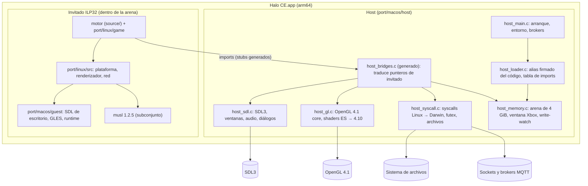

# Arquitectura

Estado: 2026-10-10. Qué hace cada pieza está en `CLAUDE.md` (stack, reglas) y
en `docs/decisions.md` (por qué). Este documento describe la organización
y el flujo de datos.

## Organización de carpetas

| Carpeta | Contenido | Ficheros C (aprox.) |
| --- | --- | --- |
| `source/` | El motor: la decompilación del juego, una carpeta por módulo (`game`, `render`, `objects`, `networking`, `interface`, ...). Compartido por todas las plataformas. | 477 |
| `port/linux/game/` | Adaptadores del juego para el port: tags, caché de Custom Edition, menús PC, red de la campaña. Compartido por Linux, Windows, Android y macOS. | 42 |
| `port/linux/src/` | Capa de plataforma de escritorio (SDL, ficheros, red POSIX, renderizador D3D8→GL, audio). Compartida por Linux y, en parte, por Windows y macOS. | 38 |
| `port/include/xdk/` | Declaraciones del SDK de Xbox que usa el motor. | — |
| `port/windows/` | Capa de Windows (Win32, ANGLE, actualizador). | — |
| `port/android/` | Port de Android: app Java, host (`libmain.so`) y runtime del invitado ILP32. | — |
| `port/macos/` | Port de macOS: host arm64, runtime del invitado, enlazador, `Info.plist`, icono y probes de viabilidad. | — |
| `port/assets/` | Recursos del port (menús XML, fuentes, texturas de alta resolución, brokers). No incluye datos del juego. | — |
| `tools/` | Scripts de build y de prueba (`*_build.py`, `macos_*.py`, `test_*.py`). | — |
| `docs/` | Documentación del proyecto (esta memoria). | — |
| `build/` | Salida de compilación (ignorada por git). | — |

## Organización del port de macOS

El port reutiliza el motor y el código de plataforma de Linux sin cambios
en el motor. Dos procesos conceptuales conviven en el mismo binario:

- **Host** (`port/macos/host/`): programa nativo arm64. Reserva la arena,
  carga la imagen del invitado, sirve las llamadas del invitado (sistema,
  SDL, OpenGL) y arranca el hilo principal.
- **Invitado** (`port/macos/guest/` + motor + `port/linux/src` + `port/linux/game`):
  código `arm64_32` que se ejecuta dentro de la arena. Solo llama al host
  a través de imports (stubs generados).

## Flujo de arranque (macOS)

1. `main` (`host_main.c`) crea `~/Library/Application Support/Halo CE`, copia
   `brokers.txt` desde el bundle y escribe el log del host.
2. `host_load_image` reserva la arena de 4 GiB, alias de solo lectura y
   ejecución del código firmado (`vm_remap`) en `0x88000000`, copia los datos
   del invitado y resuelve sus imports con los bridges.
3. `host_run_guest_main` ejecuta `__guest_start` en el hilo principal, con su
   pila en la arena. El invitado llama a `main()` del juego.
4. El juego pide SDL, ventana y contexto GL al host. Los eventos vuelven al
   juego por `host_sdl_poll_event`.

## Flujo de datos

| Origen | Camino | Destino |
| --- | --- | --- |
| Teclado, ratón, mando | SDL → `host_sdl_poll_event` → evento copiado a la memoria del invitado → `sdl_platform.c` | Entrada del juego |
| Dibujo | Motor → `d3d8_gl.c` (órdenes D3D8 traducidas) → stubs `hostgl_*` → `host_gl.c` → GL 4.1 | Pantalla |
| Archivos (`z:\`, `d:\`) | `xbox_files.c` → `posix_*` (host) → Darwin | Datos y partidas en la carpeta de usuario |
| Red (partidas públicas) | `p2p*.c` → `posix_socket_*` → sockets del host → brokers MQTT | Listados y señalización |
| Sonido | Motor → `dsound_sdl.c` → stream SDL (el callback corre en un hilo con pila de arena) | Salida de audio |
| Memoria del Xbox | `xbox_memory.c` → `mmap` del invitado → `host_guest_mmap` → arena | Páginas de la ventana Xbox |

## Patrones de diseño

- **Adaptador / bridge generado:** cada import del invitado tiene un bridge
  que traduce punteros de invitado a nativos (`tools/macos_host_bridges.py`).
  Los stubs del lado del invitado los genera `tools/android_imports.py`.
- **Tabla de handles:** los objetos de SDL (ventanas, contextos, mandos,
  streams) no caben en 32 bits; el invitado recibe índices (`host_sdl.c`).
- **Arena de páginas:** un único espacio de direcciones de 4 GiB; las
  asignaciones son páginas de 16 KiB en rangos libres (`host_memory.c`).
- **Seguimiento de escrituras:** la ventana Xbox se protege con `mprotect`;
  el manejador de SIGSEGV marca las páginas tocadas (`memory_watch`).
- **Hilo recolector:** libera las pilas de los hilos que han terminado
  (`host_thread.c`).
- **Macros de plataforma:** `HALO_ANDROID`, `HALO_GUEST` (ABI del invitado),
  `HALO_MACOS`, `HALO_GLES`, `__APPLE__`, `_WIN32`. Ver `docs/decisions.md`.
- **Configuración por variables de entorno:** cada ajuste de `config.toml`
  tiene su variable `HALO_*` (`port_config.c`). El host reenvía las `HALO_*` al invitado.

## Tests

- `tools/test_linux_port.py`: herramientas de Linux. En macOS, 3 de sus 13
  tests fallan por ser del target Linux (ver `docs/macos-port-audit.md`).
- `tools/test_macos_port.py`: 22 pruebas del port de macOS (paso de arena,
  probes, host, bundle, DMG y, con datos, arranque y render).
